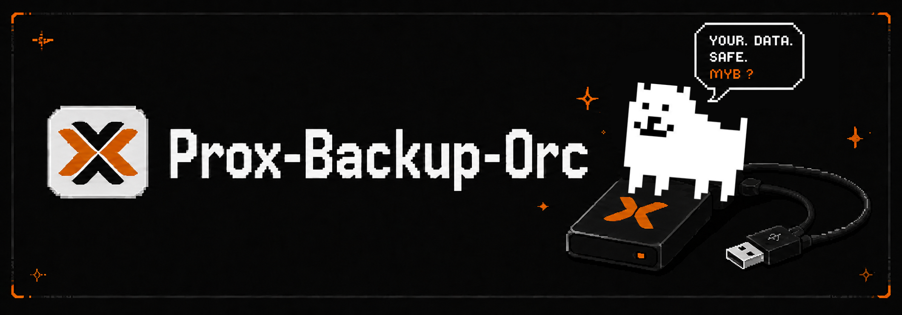

<p align="center">
  
</p>

Proxmox Backup Orchestrator coordinates removable-disk backups for a small Proxmox and Proxmox Backup Server environment. The application runs in a VM named `backupOrchestrator`; privileged disk and VM operations stay on purpose-built root agents running on the Proxmox host and the PBS VM.

The normal production flow is:

1. Detect an external USB disk on the Proxmox host.
2. Pass that USB disk through to the PBS VM.
3. Prepare or reuse a dedicated PBS datastore on the external disk.
4. Sync backups from the main PBS datastore to the external datastore.
5. Safely eject the disk from the UI by unmounting it in PBS and removing USB passthrough from the PBS VM.

**Safety warning:** dedicated disk mode can format the selected disk on first preparation. Use a disk dedicated to external PBS backups and verify the selected USB device before confirming destructive preparation.

## Architecture

```text
Browser
  |
  v
backupOrchestrator VM
  Docker Compose
    - Web UI
    - FastAPI API
    - Postgres
  |
  | HOST_AGENT_BASE_URL + HOST_AGENT_TOKEN
  v
Proxmox host
  /opt/proxmox-backup-orchestrator-agent
  proxmox-backup-orchestrator-agent-http.service
  HTTP port 8090
  root operations:
    - inspect USB disks
    - attach/remove USB passthrough on PBS VM
  |
  | USB passthrough
  v
PBS VM
  /opt/proxmox-backup-orchestrator-pbs-agent
  proxmox-backup-orchestrator-pbs-agent-http.service
  HTTP port 8091
  root operations:
    - prepare/reuse external datastore
    - run PBS datastore sync
    - unmount datastore for safe eject
```

Ports `8090` and `8091` must not be exposed broadly. The Proxmox firewall should allow port `8090` only from the app VM IP, and PBS `nftables` should allow port `8091` only from the app VM IP.

## Main Features

- Single-user web authentication with bcrypt password hashing.
- Proxmox and PBS API integration through API tokens.
- Host root agent for USB discovery and QEMU USB passthrough.
- PBS root agent for dedicated external datastore preparation, sync, and unmount.
- Dedicated external datastore reuse after the first preparation.
- Safe eject workflow that unmounts the datastore and detaches the USB device from the PBS VM.
- Activity tracking and cleanup for external backup operations.
- Security-first deployment model with random shared tokens and firewall isolation.

## Production Documentation

- [Installation](docs/INSTALLATION.md)
- [Operations](docs/OPERATIONS.md)
- [Disaster Recovery](docs/DISASTER_RECOVERY.md)
- [Security](docs/SECURITY.md)

Older architecture notes remain available in [docs/architecture.md](docs/architecture.md).
